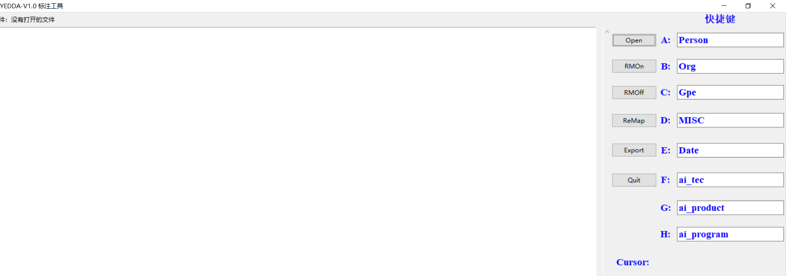
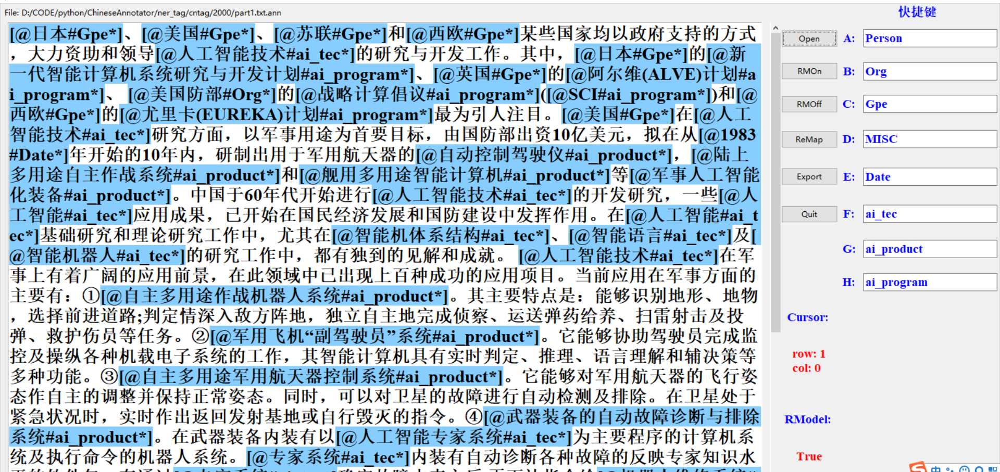
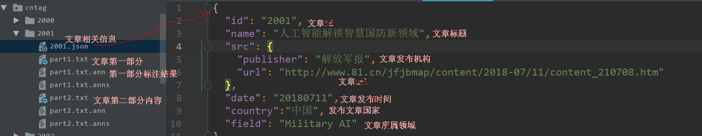

### ner_tag
命名实体识别标注数据集项目

#### 目录简介

cntag为中文标注数据，以文章id作为目录名，内包含文章信息，标注原文，以及标注结果

tagged.txt为已标注文章标题

data_process.py 为数据处理脚本，包括去冗余，写入json等

entag为英文标注数据,同上

标注结果：

```
无 B-ai_product
人 I-ai_product
潜 I-ai_product
航 I-ai_product
器 I-ai_product
， O
也 O
可 O
称 O
为 O
无 B-ai_product
人 I-ai_product
水 I-ai_product
下 I-ai_product
航 I-ai_product
行 I-ai_product
器 I-ai_product
```

summary_to_xls为汇总程序

#### 标注工具及流程

##### 工具地址：

python3 版本 https://github.com/SophonPlus/ChineseAnnotator  

python2 版本 https://github.com/jiesutd/YEDDA 

##### 标注流程

首先下载工具，参考介绍博客 https://www.cnblogs.com/combfish/p/7830807.html

`git clone https://github.com/SophonPlus/ChineseAnnotator.git` 或直接下载 [压缩包](https://github.com/SophonPlus/ChineseAnnotator/archive/master.zip) 并解压

其次进行工具设置：

- 源代码YEDDA_Annotator.py中，参数 `self.seged` 用于控制导出的行为。如果句子由空格间隔的单词构成（英文或已分词的中文），则该值应设置为 `True`，否则应设置为 `False`（如未分词的中文）
- 另一个参数 `self.tagScheme` 控制导出的格式，self.tagScheme = "BIO" ，***".anns"*** 文件导出格式为 `"BIO"`

其次开始标注

- 执行 `python YEDDA_Annotator.py`，启动标注程序

- 在标注程序界面的右侧，设置快捷键，如图：

- 

- 点击 `ReMap` 按钮，保存快捷键设置

- 点击 `Open` 按钮，选择文件 (后缀必须为 .txt 或 .ann)

- 选中文本，然后使用设置好的快捷键进行标注，标注格式形如 `[@the text span＃Location*]`

  

- 通过 `RMOn` 和 `RMOff` 按钮，可以开启或关闭智能推荐

- 智能推荐会根据已经手动标注的数据，自动标注未标注的数据。其格式为 `[$the text span＃Location*]`，并用绿色展示出来（注意：手动标注以 `[@` 打头，而推荐标注则以 `[$` 打头）

- 标注结果与原始文件保存在同一个目录中，文件名为 ***"原文件名 + .ann"***

##### 标注注意事项

1 每次open的文件不能太大，若太大，后期标注电脑会卡顿，因此需要分块

2 注意检查设置是否正确，`self.seged`中文为 `False` ，英文为`True`，self.tagScheme = "BIO"

3 选择已经标注的实体，或将光标置于已标注的实体范围内，按其他实体类别的快捷键 (如 `x`) 更新实体类别 (与 `x` 对应的实体)，按 `q`，删除实体标注

#### 标注体系

##### 标注类别 

**采用BIO 方式(Begin Inside Other)**

通用实体(Person:人名，Org：组织，Gpe:国家/地区，Date：时间)首字母大写，MISC表示其他非AI实体（比如第一次世界大战、枭龙战斗机等）

**网络攻防领域特殊实体**

攻防技术/网络武器诸如蠕虫病毒：net_tec

网络攻防事件诸如网络战役：net_event

网络应用/产品诸如数据库：net_product)

**情报AI领域特殊实体**

军事情报AI技术[如双向神经网络模型]：ai_tec

情报AI项目[欧盟机器人研发计划（SPARC)]：ai_program

军事情报AI产品应用[如智能火力打击目标搜索系统])：ai_product）

##### 标注结果存储

标注完成后存放到tag目录下，分为cntag和entag，详情见cntag目录

一个文件夹每存入一篇文章，以文章id作为文件夹命名 英文以1xxx开头，中文以2xxx开头

里面包含

文章的描述信息，如下图

分块的文章内容 如part1.txt表示文章原文  part1.txt.anns 表示第一部分标注结果




